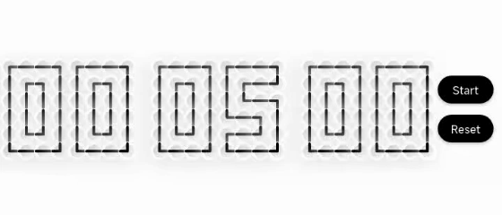
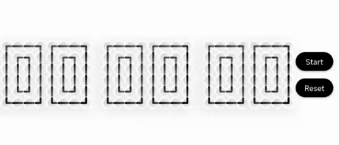
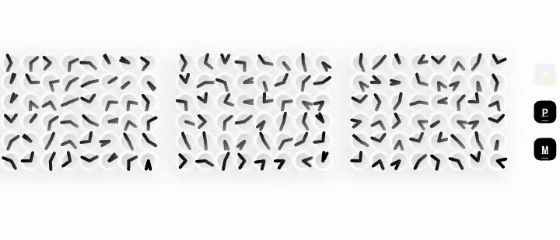

# Animated Digital Clock


A beautiful, customizable digital clock made of clocks inspired from this [](https://www.reddit.com/r/webdev/comments/1nrx5n9/clock_made_of_clocks/) post and this [](https://www.youtube.com/watch?v=VUSCH7nQGIM&pp=wgIGCgQQAhgB) video. With **Clock**, **timer** and **stopwatch** functionality. Features animated transitions, multiple display modes, and extensive customization options.

## 🎯 Features

- 🕒 **Multiple Modes**: Real-time clock, countdown timer, stopwatch, and static time display
- 🎨 **Fully Customizable**: Colors, sizes, shadows, and animations
- ⏰ **12/24 Hour Format**: Support for both time formats with AM/PM indicator
- 🎯 **Animated Transitions**: Smooth clock hand movements
- 🎮 **Controller Support**: Programmatic control for timer and stopwatch
- 📱 **Responsive Design**: Adapts to different screen sizes
- 🎪 **Flexible Layout**: Horizontal scrolling for small screens
- 🔄 **Static Time Display**: Show specific times without updates

## 📸 Preview


_Real-time clock_

## 📦 Installation

### Add dependency

Run this command:

```bash
flutter pub add animated_digital_clock
```

This will add the following to your `pubspec.yaml`:

```yaml
dependencies:
  animated_digital_clock: ^1.0.0
```

### Import the package

```dart
import 'package:animated_digital_clock/animated_digital_clock.dart';
```

## 🚀 Quick Start

### Basic Real-time Clock

```dart
ClockWidget.clock(
  clockSize: 15.0,
  twelveHourFormat: true,
  colors: ClockColors(backgroundColor: Colors.white)
)
```


### Countdown Timer

```dart
final controller = ClockController();

ClockWidget.timer(
  clockSize: 15.0,
  initialTimerDuration: Duration(minutes: 5),
  controller: controller,
  showControls: true,
)
```



### Stopwatch

```dart
final controller = ClockController();

ClockWidget.stopwatch(
  clockSize: 15.0,
  controller: controller,
  showControls: true,
)
```



### Static Time Display

```dart
ClockWidget.static(
  staticTime: DateTime(2023, 12, 25, 14, 30, 0), // 2:30 PM or DateTime.now()
  clockSize: 15.0,
  animateToPosition: true,
)
```



## 🎨 Customization Examples

### Custom Styled Clock

```dart
ClockWidget.clock(
  clockSize: 15.0,
  colors: ClockColors(
    background: Colors.white,
    topShadow: Colors.red,
    bottomShadow: Colors.yellow,
    innerShadow: Colors.blue,
    clockFace: Colors.purple,
    hand: Colors.lime,
    border: Colors.teal,
    periodColors: PeriodColors(
    activeBackground: Colors.blue,
    inactiveBackground: Colors.red,
    ),
  ),
  twelveHourFormat: true,
  shadow: true,
  borderWidth: 2.0,
  handWidth: 2.0,
)
```


## 🎮 Controller Usage

### Programmatic Control

```dart
final controller = ClockController();

// Listen to state changes
controller.isRunning.addListener(() {
  print('Running: ${controller.isRunning.value}');
});

controller.currentDuration.addListener(() {
  print('Duration: ${controller.currentDuration.value}');
});

// Control actions
controller.onStart?.call();    // Start timer/stopwatch
controller.onPause?.call();    // Pause timer/stopwatch
controller.onReset?.call();    // Reset timer/stopwatch
```

### Integration with UI

```dart
ValueListenableBuilder<Duration>(
  valueListenable: controller.currentDuration,
  builder: (context, duration, child) {
    return Text(
      'Remaining: ${duration.inMinutes}:${(duration.inSeconds % 60).toString().padLeft(2, '0')}',
      style: TextStyle(fontSize: 16),
    );
  },
)
```

## 📐 All Properties

### ClockWidget Properties

| Property            | Type          | Default         | Description                       |
| ------------------- | ------------- | --------------- | --------------------------------- |
| `clockSize`         | `double`      | `20.0`          | Base size for clock segments      |
| `height`            | `double?`     | `null`          | Custom height for the widget      |
| `colors`            | `ClockColors` | `ClockColors()` | Color customization               |
| `twelveHourFormat`  | `bool`        | `false`         | Use 12-hour format with AM/PM     |
| `shadow`            | `bool`        | `true`          | Enable shadow effects             |
| `borderWidth`       | `double`      | `2.0`           | Clock border width                |
| `handWidth`         | `double`      | `2.0`           | Clock hand width                  |
| `showControls`      | `bool`        | `false`         | Show control buttons              |
| `animateToPosition` | `bool`        | `false`         | Animate to position (static mode) |

### clockColors Properties

| Property       | Type    | Default              | Description         |
| -------------- | ------- | -------------------- | ------------------- |
| `background`   | `Color` | `Colors.transparent` | Widget background   |
| `clockFace`    | `Color` | `Color(0xFFffffff)`  | Clock face color    |
| `border`       | `Color` | `Colors.white`       | Clock border color  |
| `hand`         | `Color` | `Colors.black`       | Clock hand color    |
| `innerShadow`  | `Color` | `Color(0xFFd0d0d0)`  | Inner shadow color  |
| `bottomShadow` | `Color` | `Color(0xFFd0d0d0)`  | Bottom shadow color |
| `topShadow`    | `Color` | `Colors.white`       | Top shadow color    |

### periodColors Properties

| Property             | Type    | Default        | Description                      |
| -------------------- | ------- | -------------- | -------------------------------- |
| `activeText`         | `Color` | `Colors.white` | Active period text color         |
| `activeBackground`   | `Color` | `Colors.black` | Active period background color   |
| `inactiveText`       | `Color` | `Colors.white` | Inactive period text color       |
| `inactiveBackground` | `Color` | `Colors.grey`  | Inactive period background color |

### controlButtonColors Properties

| Property          | Type    | Default        | Description                   |
| ----------------- | ------- | -------------- | ----------------------------- |
| `startBackground` | `Color` | `Colors.black` | Start button background color |
| `pauseBackground` | `Color` | `Colors.black` | Pause button background color |
| `resetBackground` | `Color` | `Colors.black` | Reset button background color |
| `startText`       | `Color` | `Colors.white` | Start button text color       |
| `pauseText`       | `Color` | `Colors.white` | Pause button text color       |
| `resetText`       | `Color` | `Colors.white` | Reset button text color       |

## 🛠️ Advanced Usage

### Custom Button Sizes

```dart
ClockWidget.timer(
  clockSize: 15.0,
  controller: controller,
  showControls: true,
  buttonWidth: 80.0,
  buttonHeight: 40.0,
  buttonFontSize: 14.0,
  buttonPadding: EdgeInsets.symmetric(horizontal: 16, vertical: 8),
)
```

### Responsive Layout

```dart
LayoutBuilder(
  builder: (context, constraints) {
    final clockSize = constraints.maxWidth / 25;
    return ClockWidget.clock(
      clockSize: clockSize,
      twelveHourFormat: true,
    );
  },
)
```

## 🐛 Troubleshooting

### Clock Not Updating?

```dart
// Make sure you're using the correct mode
ClockWidget.clock() // For real-time updates
ClockWidget.static() // For static time display
```

### Controls Not Showing?

```dart
// Enable controls explicitly
ClockWidget.timer(
  showControls: true, // ← This must be true
  controller: controller,
)
```

### Animation Not Working?

```dart
// For static mode, enable animation
ClockWidget.static(
  animateToPosition: true, // ← Enable animation
  staticTime: DateTime.now(),
)
```

## 🤝 Contributing

We welcome contributions! Please feel free to:

1. 🐛 Report bugs
2. 💡 Suggest new features
3. 🔧 Submit pull requests
4. 📖 Improve documentation

## 📜 License

MIT License - see [LICENSE](LICENSE) for details.

## 🙏 Acknowledgments

Made with ❤️ by [Raian Ruku](https://github.com/raian-ruku/custom_text_widget/blob/main/github.com/raian-ruku) for the Flutter community. Special thanks to all contributors and users!
